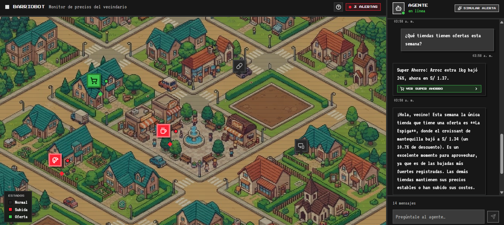
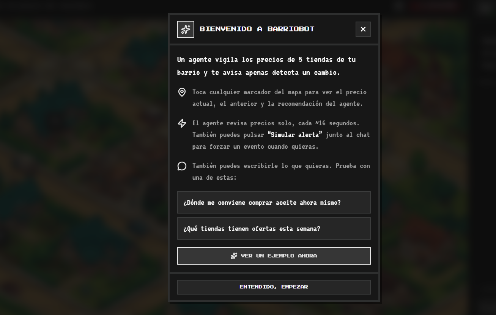

# BarrioBot

Panel interactivo estilo pixel-art que simula un agente vigilando los precios
de una zona piloto de tiendas del barrio. Cuando detecta un cambio de precio,
avisa en un chat en vivo y resalta la tienda en el mapa; al hacer clic se ve
el detalle completo (precio anterior, precio actual, variación y
recomendación). El agente también responde preguntas libres sobre los
precios, usando un LLM real cuando hay una API key configurada.

**Demo en vivo:** [v0-barriobot.vercel.app](https://v0-barriobot.vercel.app/)

## Capturas

| Mapa del vecindario + chat en vivo | Guía de bienvenida |
| --- | --- |
|  |  |

## Tech Stack

**Lenguajes**


**Frameworks y librerías**


**IA y backend**


**Herramientas y plataformas**


## Cómo funciona el agente

- `lib/stores-data.ts` define las tiendas, su catálogo de productos y la
  simulación de eventos de precio (`pickPriceEvent`).
- **Monitoreo automático:** cada ~16 segundos (o al presionar **"Simular
  alerta"** en el panel del agente) se genera un evento de cambio de precio
  y se envía a `app/api/agent/route.ts`, que redacta la notificación y la
  recomendación.
- **Chat libre:** el vecino puede escribirle lo que quiera al agente desde
  el panel de la derecha; `app/api/chat/route.ts` responde usando el precio
  actual de todas las tiendas como contexto.
- **Nunca se rompe la demo:** ambas rutas prueban los proveedores de LLM en
  orden — `ANTHROPIC_API_KEY` → `OPENAI_API_KEY` → `GEMINI_API_KEY` — y si
  ninguno está configurado (o la llamada falla) caen automáticamente a un
  generador de texto local, así el agente sigue respondiendo sin depender de
  ninguna API en el momento de la presentación.
- El estado visual de cada tienda (normal / alerta de subida / oferta) se
  calcula siempre a partir del precio real (`getStoreState`), nunca se marca
  a mano, para que el mapa y el chat nunca queden desincronizados.

## Configurar el LLM (opcional)

Copia `.env.example` a `.env.local` y define una o más:

```bash
ANTHROPIC_API_KEY=sk-ant-...
OPENAI_API_KEY=sk-...
GEMINI_API_KEY=AIza...
```

Se revisa primero `ANTHROPIC_API_KEY`, luego `OPENAI_API_KEY` y por último
`GEMINI_API_KEY`. Ninguna es obligatoria: sin key, el agente sigue
funcionando con el generador de texto local.

En Vercel: **Project Settings → Environment Variables**, agrega la(s)
misma(s) variable(s) y haz **Redeploy** — los deployments ya existentes no
recogen variables nuevas automáticamente.

## Getting Started

```bash
pnpm install
pnpm dev
```

Abre [http://localhost:3000](http://localhost:3000).

## Despliegue

Desplegado en Vercel, conectado al repositorio de GitHub — cada push a
`main` dispara un deployment nuevo automáticamente.

---

